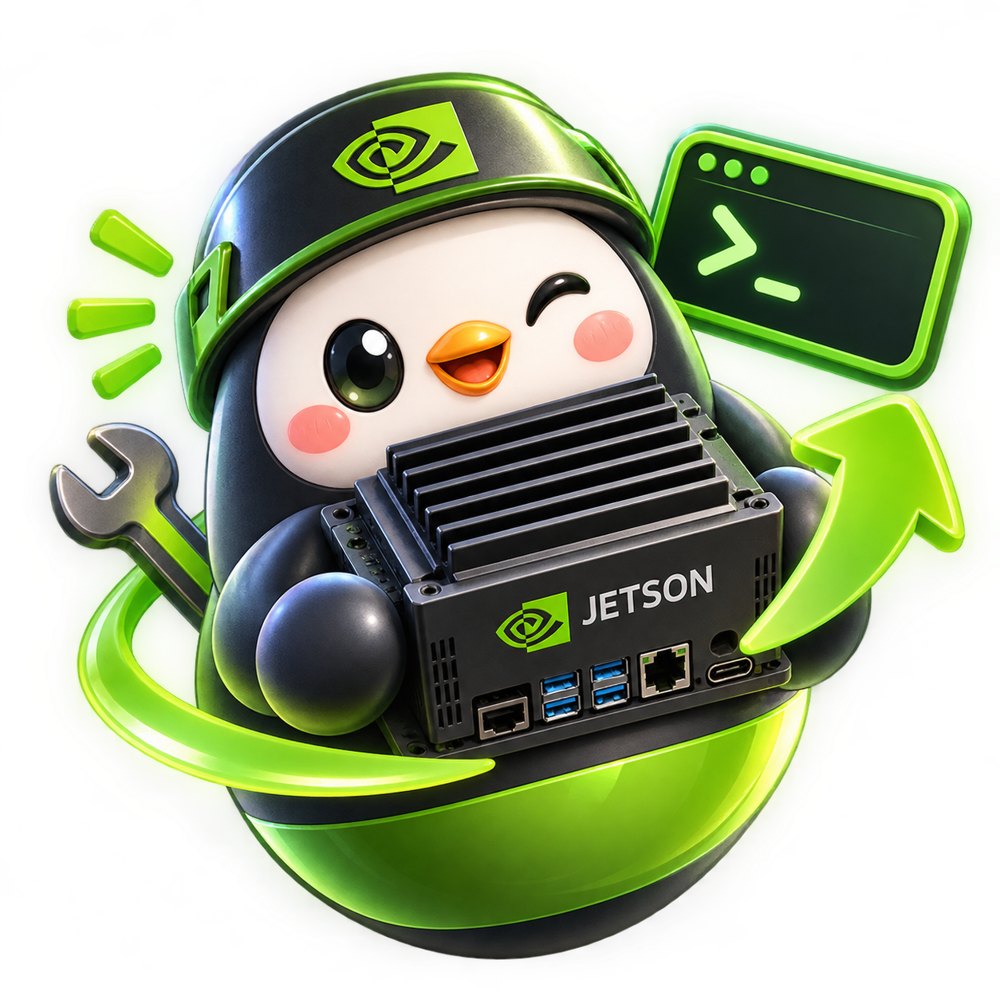

# nvflasher

<p align="center"></p>

nvflasher v0.1.0 基于 MyGo 构建，重点支持 Jetson Orin Nano Super。它调用 NVIDIA 官方 Linux for Tegra 脚本，不自行实现刷机协议。

| 功能 | Linux x86_64 | Windows / macOS |
| --- | --- | --- |
| BSP 环境检测、Recovery USB 识别 | 支持 | 禁用 |
| 单机刷写、MFI 生成与批量刷写 | 需要 root | 禁用 |
| rootfs 用户预置、装包、chroot 自定义脚本 | 需要 root | 禁用 |
| SSH 触发 Recovery、直链下载 | 支持 | 支持 |

截图：_首次发布后补充_。

## 构建与开发

需要 Go 1.27.2+、Bun、MyGo CLI 0.3.5；Linux 构建另需 GTK3 / WebKitGTK 4.1 开发环境。

```sh
bun install
go test ./...
bun run typecheck
bun run build
```

生成的 Linux 程序包位于 `build/`。图形环境下可用 `mygo dev` 开发。跨平台构建需要目标平台对应的 MyGo 工具链。

## 构建与发布

在 Linux 上分别构建两种架构的安装包：

```sh
bun run build -- -platform linux/amd64
bun run build -- -platform linux/arm64
```

每个 `build/linux-<arch>/` 目录包含 `.deb` 和 `.tar.gz` 包。GitHub Actions 每次运行 CI（包括手动 `workflow_dispatch`）都会上传 `nvflasher-linux-amd64` 和 `nvflasher-linux-arm64` artifacts。推送 `v*` tag 且测试通过后，还会将两种架构的包发布到 GitHub Release。

## 使用与风险

在刷机向导选择设备型号，再由软件下载 NVIDIA BSP（包含刷机工具）和 sample rootfs；软件核对官方 SHA1，并在 root 权限下解压和运行 `apply_binaries.sh`。目前内置 Jetson Orin Nano 8GB Developer Kit 与 Super Developer Kit 的 Jetson Linux 36.5.0 资源，两者共用下载包，但刷写板型配置不同；USB ID 不等于板卡型号，请核对设备标签。也可以手动指定已有的 `Linux_for_Tegra` 目录。刷机或预置时通过 `pkexec` 或 `sudo` 以 root 权限启动，确保设备进入 Recovery 模式。

界面支持 English / 简体中文切换，语言选择保存在本机浏览器存储中。非 root 启动时，可在环境检测页输入 sudo 密码提权重启；密码仅用于本次 sudo 验证，不写入配置或日志。提权后的程序可能使用独立的 root 用户设置，请重新确认 BSP 路径和刷写参数。

如果 BSP 准备曾在安装依赖时中断，可在“下载”步骤点击“解压并准备 BSP”继续：应用会复用已校验的归档和已解压的内容，并在重新运行 `apply_binaries.sh` 前清理上次遗留、且设备编号符合预期的 rootfs 字符设备节点；不会删除普通文件或符号链接。通过界面输入 sudo 密码提权重启需要可用的 systemd 用户会话，其他环境可使用 `pkexec`。

环境检测页可根据 Debian、Ubuntu 或 Arch（含 `ID_LIKE=arch` 的 Omarchy、EndeavourOS 等衍生版）列出缺失的软件包，复制安装命令，或在 root 界面确认后安装。Arch 上运行 `apply_binaries.sh` 需要主机安装 `dpkg`，应用会将其列入缺失依赖。Arch 安装使用 `pacman -Syu`，会升级整个系统；NVIDIA 并未认证 Arch 作为 Jetson Linux 刷写主机，安装依赖不代表刷写一定可用。

主界面按“刷机向导”和“Rootfs 配置向导”组织；刷机向导依次进入环境检测、选择设备型号、下载与准备、刷写。刷写页可进入“已有 MFI 包”子界面，选择 MFI 目录或 `.tar.gz` 压缩包刷写；生成新 MFI 包的选项默认收起。单个 ISO 或任意 `.img` 文件不能直接作为 MFI 包刷写。

预置功能显示实际使用的 `Linux_for_Tegra/rootfs`，可浏览切换目录。支持用户、overlay、chroot apt 装包、通过 stdin 执行 `chroot rootfs /bin/bash -s` 非交互脚本；可多选模板并将脚本添加到可见的编辑框，执行前请检查完整脚本。SSH Recovery 需要设备可开机、SSH 可用，且主机密钥已加入 `~/.ssh/known_hosts`。官方包自动下载支持可访问的 HTTP(S) 地址与 HTTP/HTTPS/SOCKS5 代理，不支持 NVIDIA 帐号登录。

设置写入 `os.UserConfigDir()/nvflasher/config.json`。设备和 SSH 密码不持久化；只有勾选“记住代理凭据”才会保存代理账户信息（存在泄露风险）。自定义脚本应避免输出敏感数据。

**免责声明：**使用 NVIDIA BSP 须遵守 NVIDIA EULA。刷机可能永久清除设备数据；请备份并核对目标设备及板型。风险由使用者承担。Windows/macOS 不支持刷机。

许可证：MIT。
